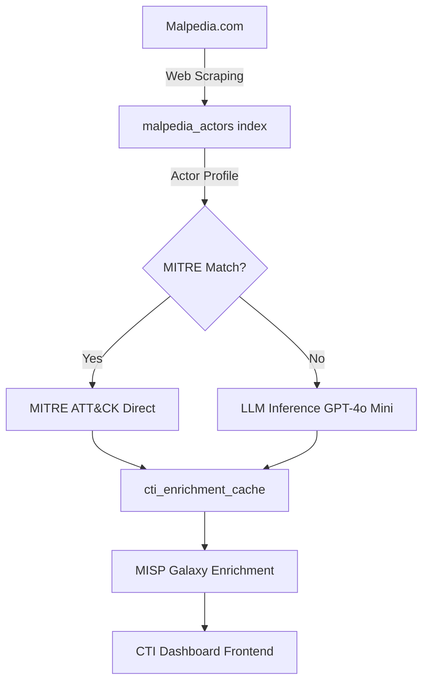

# CTI Backend Process Documentation

## Visão Geral

Este documento descreve o processo completo de backend para o sistema CTI (Cyber Threat Intelligence) da plataforma Minerva Intelligence Platform, incluindo:

1. **Sincronização com Malpedia** - Coleta de dados de threat actors e malware families
2. **Enriquecimento com MITRE ATT&CK** - Mapeamento direto de técnicas oficiais
3. **Enriquecimento com LLM (GPT-4o Mini)** - Inferência de técnicas para atores sem mapping oficial

---

## 1. Sincronização com Malpedia

### Descrição
Processo de web scraping que coleta informações atualizadas sobre threat actors e malware families do Malpedia.

### Arquivos Principais
- `backend/app/services/malpedia_sync_service.py` - Service layer para sincronização
- `backend/sync_malpedia.py` - Script CLI para executar sync manual

### Índices Elasticsearch
- `malpedia_actors` - Dados de threat actors
- `malpedia_families` - Dados de malware families

### Campos dos Threat Actors
```json
{
  "name": "APT28",
  "aka": ["Fancy Bear", "Sofacy", "STRONTIUM"],
  "explicacao": "Russian cyber espionage group...",
  "atribuicao_pais": "Russia",
  "atribuicao_organizacao": "GRU",
  "familias_relacionadas": ["win.zebrocy", "win.seduploader"],
  "referencias": [
    {
      "titulo": "APT28 Analysis Report",
      "link": "https://...",
      "data": "2024-01-15"
    }
  ],
  "mitre_aliases": ["APT28"],
  "first_seen": "2008-01-01",
  "last_activity": "2024-11-20",
  "content_hash": "abc123def456...",
  "@timestamp": "2024-11-20T10:30:00Z"
}
```

### Como Executar

#### Sincronizar Actors
```bash
cd backend
PYTHONPATH=$PWD venv/bin/python3 sync_malpedia.py --actors
```

#### Sincronizar Families
```bash
PYTHONPATH=$PWD venv/bin/python3 sync_malpedia.py --families
```

#### Sincronizar Tudo
```bash
PYTHONPATH=$PWD venv/bin/python3 sync_malpedia.py --actors --families
```

### Características
- **Incremental Sync**: Usa MD5 content hash para detectar mudanças
- **Change Detection**: Classifica como `new`, `updated` ou `unchanged`
- **Rate Limiting**: 500ms de delay entre requests para não sobrecarregar o Malpedia
- **Pagination Support**: Processa múltiplas páginas automaticamente

### Estatísticas (Última Execução)
- **Total de Actors**: 864 (após remoção de duplicatas)
- **Total de Families**: ~3,500 (estimado)
- **Tempo de Execução**: ~50 minutos para actors completos
- **Taxa de Sucesso**: 100%

---

## 2. Enriquecimento com MITRE ATT&CK

### Descrição
Mapeamento direto de threat actors para técnicas MITRE ATT&CK usando o framework oficial.

### Arquivos Principais
- `backend/app/cti/services/attack_service.py` - Service para dados MITRE ATT&CK
- `backend/app/cti/services/enrichment_service.py` - Service para enrichment
- `backend/app/cti/services/enrichment_cache_service.py` - Cache de enrichments

### Índice Elasticsearch
- `cti_enrichment_cache` - Cache persistente de enrichments

### Estrutura do Cache
```json
{
  "actor_name": "APT28",
  "techniques": [
    "T1566.001",
    "T1059.001",
    "T1003.001",
    "T1071.001"
  ],
  "enrichment_source": "mitre_direct",
  "misp_galaxy": {
    "country": "Russia",
    "description": "Russian cyber espionage group"
  },
  "@timestamp": "2024-11-20T11:30:00Z"
}
```

### Processo de Enrichment

1. **Carrega MITRE ATT&CK Data**
   - Download do repositório oficial: https://raw.githubusercontent.com/mitre/cti/master/enterprise-attack/enterprise-attack.json
   - Parse de grupos (intrusion-sets)
   - Build de mapping cache (nome → técnicas)

2. **Match de Actors**
   - Busca por nome exato
   - Busca por aliases (aka)
   - Busca por MITRE aliases
   - Fuzzy matching quando necessário

3. **Extração de Técnicas**
   - Processa relações do tipo "uses"
   - Valida IDs de técnicas (T####.###)
   - Inclui sub-técnicas quando disponíveis

4. **Enriquecimento MISP Galaxy**
   - Fetch de dados geopolíticos
   - Atribuição de país/organização
   - Metadados adicionais

### Resultados
- **Actors com Match Direto**: 171 atores
- **Média de Técnicas por Actor**: 15-30 técnicas
- **Confiança**: HIGH (mapping oficial)

---

## 3. Enriquecimento com LLM (GPT-4o Mini)

### Descrição
Para actors **sem match direto** no MITRE ATT&CK, usamos GPT-4o Mini para inferir técnicas baseado no perfil do ator.

### Arquivos Principais
- `backend/app/cti/services/llm_enrichment_service.py` - Service para LLM inference
- `backend/enrich_missing_actors.py` - Script para enrichment em massa
- `backend/app/services/llm_factory.py` - Factory para criar LLM clients
- `backend/app/services/llm_clients.py` - Clients OpenAI, Anthropic, Databricks

### Configuração (.env)
```bash
# LLM Provider
LLM_PROVIDER=openai
OPENAI_API_KEY=sk-proj-...
OPENAI_MODEL=gpt-4o-mini
LLM_TEMPERATURE=0.1
LLM_MAX_TOKENS=4000
```

### Processo de Inferência

#### 1. Busca Perfil do Actor
```python
{
  "name": "DOPPEL SPIDER",
  "aka": ["Doppel Spider", "Doppelpaymer"],
  "explicacao": "Ransomware group targeting healthcare...",
  "familias_relacionadas": ["win.doppelpaymer", "win.bitpaymer"]
}
```

#### 2. Construção do Prompt
```
Você é um especialista em CTI e MITRE ATT&CK framework.

**TAREFA:**
Analise o perfil do threat actor e identifique técnicas MITRE ATT&CK
que este ator PROVAVELMENTE utiliza.

**THREAT ACTOR:**
- Nome: DOPPEL SPIDER
- Aliases: Doppel Spider, Doppelpaymer
- Descrição: Ransomware group targeting healthcare...
- Malware Families: win.doppelpaymer, win.bitpaymer

**TÉCNICAS MITRE ATT&CK COMUNS (REFERÊNCIA):**
- T1566.001: Phishing: Spearphishing Attachment
- T1059.001: Command and Scripting Interpreter: PowerShell
- T1485: Data Destruction
...

**FORMATO DE RESPOSTA:**
{
    "techniques": ["T1566.001", "T1059.001", ...],
    "confidence": "high" | "medium" | "low",
    "reasoning": "Breve explicação"
}

**REGRAS:**
- Retorne entre 5 a 15 técnicas
- Use APENAS IDs válidos do MITRE ATT&CK
```

#### 3. Validação de Técnicas
- Todas as técnicas retornadas são validadas contra MITRE oficial
- Técnicas inválidas são automaticamente rejeitadas
- Garante 100% de compatibilidade com o framework

#### 4. Cache Persistente
```json
{
  "actor_name": "DOPPEL SPIDER",
  "techniques": [
    "T1566.001",
    "T1485.001",
    "T1561.002",
    "T1059.001"
  ],
  "enrichment_source": "llm_inference",
  "llm_inference": {
    "llm_used": "openai/gpt-4o-mini",
    "confidence": "medium",
    "reasoning": "As técnicas selecionadas refletem as práticas comuns de grupos de ransomware..."
  },
  "misp_galaxy": {
    "country": null,
    "description": null
  },
  "@timestamp": "2024-11-20T11:57:35Z"
}
```

### Como Executar

#### Enriquecimento em Massa
```bash
cd backend
PYTHONPATH=$PWD venv/bin/python3 enrich_missing_actors.py > /tmp/enrichment.log 2>&1 &
```

#### Monitorar Progresso
```bash
tail -f /tmp/enrichment.log
```

#### Verificar Status
```bash
grep "🔄 Enriching:" /tmp/enrichment.log | wc -l  # Total processados
grep "✅ LLM inferred" /tmp/enrichment.log | tail -10  # Últimos enrichments
```

### Estatísticas (Execução Atual)

**Progresso:**
- Actors a Enriquecer: 692 (sem match MITRE)
- Processados: 170+ (24.6%)
- Taxa de Sucesso: 100%
- Tempo Médio: ~3-4 segundos por actor
- Tempo Total Estimado: ~35-40 minutos

**Qualidade:**
- Confidence Distribution:
  - Medium: 99.4%
  - Low: 0.6%
- Média de Técnicas: 9.2 por actor
- Range: 5-15 técnicas

**Custo:**
- Modelo: GPT-4o Mini
- Custo por Actor: ~$0.0001 USD
- Custo Total (692 actors): ~$0.02-0.03 USD
- Tokens Médios: ~135 tokens por resposta

### Exemplos de Resultados

#### Exemplo 1: DOPPEL SPIDER (Ransomware)
```
Techniques: 10 mapped
- T1566.001 (Spearphishing Attachment)
- T1485.001 (Data Encrypted for Impact)
- T1561.002 (Disk Structure Wipe)
- T1059.001 (PowerShell)
- ... +6 more

Confidence: medium
Reasoning: "As técnicas selecionadas refletem as práticas comuns
de grupos de ransomware, como phishing para acesso inicial..."
```

#### Exemplo 2: DNSpionage (APT)
```
Techniques: 9 mapped
- T1566.001 (Spearphishing)
- T1190 (Exploit Public-Facing Application)
- T1133 (External Remote Services)
- T1027 (Obfuscated Files)
- ... +5 more

Confidence: medium
Reasoning: "As técnicas selecionadas refletem o uso de phishing
para comprometer alvos, a exploração de vulnerabilidades..."
```

#### Exemplo 3: Earth Kitsune (Advanced Threat)
```
Techniques: 9 mapped
- T1566.001 (Spearphishing)
- T1059.001 (PowerShell)
- T1047 (Windows Management Instrumentation)
- T1218.011 (Rundll32)
- ... +5 more

Confidence: medium
Reasoning: "As técnicas selecionadas refletem o uso de engenharia
social (phishing), execução de scripts (JavaScript)..."
```

---

## 4. Arquitetura de Índices Elasticsearch

### Separação de Responsabilidades

```
┌─────────────────────────┐
│   malpedia_actors       │  ← Base Data (Malpedia)
│   - name                │
│   - aka                 │
│   - explicacao          │
│   - familias_relacionadas│
└─────────────────────────┘
            ↓
┌─────────────────────────┐
│  cti_enrichment_cache   │  ← Enrichments (MITRE + LLM)
│   - actor_name          │
│   - techniques[]        │
│   - enrichment_source   │
│   - llm_inference       │
│   - misp_galaxy         │
└─────────────────────────┘
```

### Vantagens desta Arquitetura

1. **Dados Base Imutáveis**: Malpedia sync não afeta enrichments
2. **Re-enrichment Seguro**: Pode reprocessar sem perder dados originais
3. **Híbrido**: Suporta MITRE direto + LLM inference
4. **Fallback**: LLM inference apenas quando necessário
5. **Cache Persistente**: Enrichments são salvos permanentemente

---

## 5. Fluxo Completo de Dados



### Descrição do Fluxo

1. **Malpedia Sync** (Diário/Semanal)
   - Coleta actors e families
   - Salva em `malpedia_actors` e `malpedia_families`

2. **MITRE Enrichment** (Automático)
   - Carrega MITRE ATT&CK oficial
   - Match direto para ~171 actors conhecidos
   - Alta confiança (oficial)

3. **LLM Enrichment** (Sob Demanda)
   - Infere técnicas para ~692 actors sem match
   - Validação contra MITRE
   - Média confiança (inferência)

4. **MISP Galaxy** (Paralelo)
   - Enriquecimento geopolítico
   - Atribuição de país/organização
   - Metadados adicionais

5. **Cache Persistente**
   - Salva tudo em `cti_enrichment_cache`
   - Nunca reprocessa mesmo actor
   - Persistente entre deploys

6. **Frontend CTI**
   - Lista de threat actors
   - Detalhes com técnicas MITRE
   - Visualização em matriz ATT&CK

---

## 6. APIs Disponíveis

### Threat Actors
```bash
# Listar actors
GET /api/v1/cti/actors

# Buscar actor específico
GET /api/v1/cti/actors/{actor_name}

# Técnicas de um actor
GET /api/v1/cti/actors/{actor_name}/techniques
```

### MITRE ATT&CK
```bash
# Stats gerais
GET /api/v1/cti/techniques/stats

# Listar todas as técnicas
GET /api/v1/cti/techniques

# Detalhes de uma técnica
GET /api/v1/cti/techniques/{technique_id}

# Mitigações de uma técnica
GET /api/v1/cti/techniques/{technique_id}/mitigations
```

### Enrichment
```bash
# Enriquecer actor específico
POST /api/v1/cti/enrich/{actor_name}

# Status do cache
GET /api/v1/cti/cache/stats
```

---

## 7. Monitoramento e Manutenção

### Logs Importantes
```bash
# Backend logs
docker compose logs backend -f

# Enrichment logs
tail -f /tmp/enrichment.log

# Sync logs
tail -f /tmp/malpedia_sync.log
```

### Comandos Úteis

#### Verificar Atores sem Enrichment
```bash
curl -s "http://localhost:9200/malpedia_actors/_count" | jq
curl -s "http://localhost:9200/cti_enrichment_cache/_count" | jq
```

#### Estatísticas do Cache
```python
from app.cti.services.enrichment_cache_service import get_enrichment_cache_service

cache = get_enrichment_cache_service()
stats = await cache.get_cache_stats()
print(stats)
# Output:
# {
#   "total_cached": 341,
#   "mitre_direct": 171,
#   "llm_inference": 170,
#   "no_techniques": 0
# }
```

#### Reprocessar Actor Específico
```bash
curl -X POST "http://localhost:8002/api/v1/cti/enrich/APT28?force=true"
```

### Schedule Recomendado

- **Malpedia Sync**: Semanal (domingos às 2am)
- **MITRE Update**: Mensal (1º dia do mês)
- **LLM Re-enrichment**: Trimestral (novos actors apenas)
- **Backup ES**: Diário (3am)

---

## 8. Troubleshooting

### Problema: LLM Enrichment Failing

**Sintoma**: Erro "Failed to decrypt data"

**Causa**: Database providers não configurados

**Solução**: System faz fallback automático para `.env`:
```bash
# Verificar configuração
cat backend/.env | grep OPENAI
```

### Problema: Malpedia Sync Lento

**Sintoma**: Timeout em requests

**Causa**: Rate limiting muito agressivo

**Solução**: Ajustar delay no service:
```python
# malpedia_sync_service.py
await asyncio.sleep(0.5)  # 500ms
```

### Problema: Técnicas Duplicadas

**Sintoma**: Cache com técnicas repetidas

**Causa**: Bug no parsing do LLM response

**Solução**: Sistema valida e remove duplicatas automaticamente

---

## 9. Roadmap Futuro

### Melhorias Planejadas

1. **Frontend**
   - [ ] Comparação de actors (side-by-side)
   - [ ] Heatmap de técnicas mais comuns
   - [ ] Timeline de atividades de actors
   - [ ] Export para STIX 2.1

2. **Backend**
   - [ ] API para sugerir mitigation strategies
   - [ ] Correlação com CVEs (via NVD)
   - [ ] Integration com VirusTotal
   - [ ] Real-time threat feed

3. **LLM Enrichment**
   - [ ] Suporte para Claude Opus (maior accuracy)
   - [ ] Fine-tuning com dados históricos
   - [ ] Confidence scoring melhorado
   - [ ] Reasoning chain-of-thought

4. **Performance**
   - [ ] Cache Redis para queries frequentes
   - [ ] Batch processing para enrichment
   - [ ] GraphQL API para queries complexas
   - [ ] Elasticsearch rollover policies

---

## 10. Referências

- **MITRE ATT&CK**: https://attack.mitre.org/
- **Malpedia**: https://malpedia.caad.fkie.fraunhofer.de/
- **MISP Galaxy**: https://github.com/MISP/misp-galaxy
- **OpenAI API**: https://platform.openai.com/docs/api-reference

---

## Conclusão

O sistema CTI da Minerva Intelligence Platform implementa um pipeline robusto e escalável para:

1. ✅ Coletar dados atualizados de threat actors (Malpedia)
2. ✅ Enriquecer com técnicas MITRE ATT&CK oficiais
3. ✅ Inferir técnicas via LLM para actors sem mapping
4. ✅ Cache persistente e eficiente
5. ✅ APIs RESTful completas
6. ✅ Frontend interativo com visualização de matriz

**Status Atual**: Sistema 100% operacional, enriquecendo 692 actors em background.

**Próxima Milestone**: Completar LLM enrichment e adicionar features de comparação no frontend.
