# 📡 MISP Feeds - Documentação Completa

**Versão**: 1.0
**Data**: 2025-01-22
**Status**: ✅ Operacional (12/14 feeds ativos)

---

## 📋 Índice

1. [Visão Geral](#visão-geral)
2. [Feeds Configurados](#feeds-configurados)
3. [Sincronização Automática](#sincronização-automática)
4. [Parsers Implementados](#parsers-implementados)
5. [Arquitetura Técnica](#arquitetura-técnica)
6. [Troubleshooting](#troubleshooting)
7. [Manutenção e Monitoramento](#manutenção-e-monitoramento)

---

## 🎯 Visão Geral

### O que são feeds MISP?

MISP (Malware Information Sharing Platform) feeds são fontes de inteligência de ameaças que fornecem Indicadores de Comprometimento (IOCs) atualizados regularmente. Estes feeds são essenciais para:

- 🛡️ **Detecção de Ameaças**: Identificar IPs, URLs, hashes e domínios maliciosos
- 🔍 **Investigação**: Correlacionar eventos de segurança com inteligência global
- 📊 **Contexto**: Enriquecer alertas com informações de threat intelligence
- 🚨 **Prevenção**: Bloquear ameaças conhecidas proativamente

### Estatísticas do Sistema

| Métrica | Valor |
|---------|-------|
| **Total de Feeds Configurados** | 14 |
| **Feeds Ativos/Sincronizados** | 12 (86%) |
| **Cobertura MISP Padrão** | 75% |
| **Total de IOCs Importados** | 1,143 |
| **Frequência de Sincronização** | 4x por dia |
| **Última Atualização** | 2025-01-22 |

---

## 📊 Feeds Configurados

### Resumo por Status

```
✅ SINCRONIZADOS (12 feeds):
   • 7 feeds legados (já estavam funcionando)
   • 3 feeds novos implementados (Feodo, Malware Bazaar, FireHOL)
   • 2 feeds antigos sincronizados (DiamondFox, SSL Blacklist)

❌ PENDENTES (2 feeds):
   • PhishTank (problema de redirect/autenticação)
   • DigitalSide (servidor temporariamente indisponível)
```

### 1. URLhaus (abuse.ch)

**Status**: ✅ Operacional
**Tipo**: URL
**IOCs Importados**: 200
**Provider**: abuse.ch
**Descrição**: URLs distribuindo malware

**URL**: `https://urlhaus.abuse.ch/downloads/csv_recent/`
**Formato**: CSV
**Frequência**: Atualizado continuamente
**Tags**: `malware`, `url`, `urlhaus`

**Características**:
- URLs recentes distribuindo malware
- Inclui informações sobre malware family
- Alta confiabilidade (abuse.ch é fonte confiável)
- ~1,000 IOCs por dia

**Use Cases**:
- Bloqueio de URLs maliciosas em proxies/firewalls
- Detecção de downloads maliciosos
- Investigação de campanhas de malware

---

### 2. ThreatFox (abuse.ch)

**Status**: ✅ Operacional
**Tipo**: Mixed (IPs, URLs, Hashes)
**IOCs Importados**: 150
**Provider**: abuse.ch
**Descrição**: IOCs de malware (IPs, URLs, hashes)

**URL**: `https://threatfox.abuse.ch/export/csv/recent/`
**Formato**: CSV
**Frequência**: Atualizado continuamente
**Tags**: `malware`, `threatfox`, `mixed`

**Características**:
- IOCs multi-tipo em um único feed
- Inclui context (malware family, confiança)
- Foco em ameaças recentes (últimas 48h)
- Cobertura ampla de famílias de malware

**Use Cases**:
- Detecção multi-layer (network + endpoint)
- Enriquecimento de alertas
- Threat hunting

---

### 3. OpenPhish

**Status**: ✅ Operacional
**Tipo**: URL
**IOCs Importados**: 100
**Provider**: openphish.com
**Descrição**: URLs de phishing verificadas

**URL**: `https://raw.githubusercontent.com/openphish/public_feed/refs/heads/main/feed.txt`
**Formato**: TXT (uma URL por linha)
**Frequência**: Atualizado a cada 30 minutos
**Tags**: `phishing`, `url`, `openphish`

**Características**:
- URLs de phishing ativas
- Verificação automatizada
- Feed público gratuito
- ~100-200 novas URLs por dia

**Use Cases**:
- Bloqueio de sites de phishing
- Proteção de usuários
- Email security (block phishing links)

---

### 4. DiamondFox C2 Panels (Unit42)

**Status**: ✅ Sincronizado (0 IOCs)
**Tipo**: URL
**IOCs Importados**: 0
**Provider**: Palo Alto Unit42
**Descrição**: C2 panels do malware DiamondFox

**URL**: `https://raw.githubusercontent.com/pan-unit42/iocs/master/diamondfox/diamondfox_panels.txt`
**Formato**: TXT com URLs
**Frequência**: Atualizado irregularmente
**Tags**: `c2`, `diamondfox`, `malware`

**Características**:
- IOCs históricos de DiamondFox
- Mantido por analistas da Unit42
- Pode conter dados antigos
- Útil para investigações históricas

**Nota**: Feed sincronizado mas sem IOCs ativos no momento.

---

### 5. abuse.ch SSL Blacklist

**Status**: ✅ Sincronizado (0 IOCs)
**Tipo**: SSL Certificate Fingerprint
**IOCs Importados**: 0
**Provider**: abuse.ch
**Descrição**: Fingerprints SSL de malware/C2

**URL**: `https://sslbl.abuse.ch/blacklist/sslblacklist.csv`
**Formato**: CSV
**Frequência**: Atualizado diariamente
**Tags**: `ssl`, `malware`, `c2`, `certificate`

**Características**:
- SHA1 fingerprints de certificados SSL maliciosos
- Usado para detecção de C2 via SSL/TLS
- Inclui informações sobre malware family
- Útil para network monitoring

**Use Cases**:
- Detecção de C2 criptografado
- Network security monitoring
- SSL inspection rules

**Nota**: Feed sincronizado mas sem IOCs ativos no momento.

---

### 6. GreenSnow Blocklist

**Status**: ✅ Operacional
**Tipo**: IP
**IOCs Importados**: 200
**Provider**: GreenSnow
**Descrição**: IPs maliciosos de ataques

**URL**: `https://blocklist.greensnow.co/greensnow.txt`
**Formato**: TXT (um IP por linha)
**Frequência**: Atualizado a cada 15 minutos
**Tags**: `malicious-ip`, `blocklist`, `greensnow`

**Características**:
- IPs de ataques SSH, brute force, scans
- Dados de honeypots globais
- Alta taxa de atualização
- ~200-500 IPs ativos

**Use Cases**:
- Bloqueio de IPs atacantes
- Firewall rules
- IDS/IPS signatures

---

### 7. blocklist.de All Lists

**Status**: ✅ Operacional
**Tipo**: IP
**IOCs Importados**: 200
**Provider**: blocklist.de
**Descrição**: IPs atacantes agregados

**URL**: `https://lists.blocklist.de/lists/all.txt`
**Formato**: TXT (um IP por linha)
**Frequência**: Atualizado a cada hora
**Tags**: `malicious-ip`, `blocklist`, `attackers`

**Características**:
- Agregação de múltiplos tipos de ataque
- SSH, FTP, mail, Apache attacks
- Lista consolidada
- ~1,000-2,000 IPs

**Use Cases**:
- Firewall global blacklist
- Rate limiting
- Geo-blocking complementar

---

### 8. DigitalSide Threat-Intel

**Status**: ❌ Pendente (servidor indisponível)
**Tipo**: MISP Format (mixed)
**IOCs Importados**: 0
**Provider**: DigitalSide
**Descrição**: Feed MISP nativo com IOCs diversos

**URL**: `https://osint.digitalside.it/Threat-Intel/digitalside-misp-feed/`
**Formato**: MISP JSON (manifest + events)
**Frequência**: Atualizado diariamente
**Tags**: `digitalside`, `misp`, `mixed`

**Características**:
- Formato nativo MISP
- IOCs multi-tipo (IPs, URLs, hashes, domains)
- Inclui eventos completos com contexto
- Gratuito para uso

**Status Atual**: Parser implementado, aguardando servidor voltar online.

---

### 9. ProofPoint Emerging Threats

**Status**: ✅ Operacional
**Tipo**: IP
**IOCs Importados**: 150
**Provider**: ProofPoint
**Descrição**: IPs comprometidos (bots, proxies, C2)

**URL**: `https://rules.emergingthreats.net/blockrules/compromised-ips.txt`
**Formato**: TXT (um IP por linha)
**Frequência**: Atualizado diariamente
**Tags**: `compromised`, `botnet`, `c2`, `proxy`

**Características**:
- IPs de hosts comprometidos
- Usado em regras Snort/Suricata
- Alta qualidade (baixa taxa de falsos positivos)
- ~500-1,000 IPs

**Use Cases**:
- IDS/IPS rules
- Bloqueio de C2 traffic
- Network segmentation

---

### 10. AlienVault IP Reputation

**Status**: ✅ Operacional
**Tipo**: IP
**IOCs Importados**: 143
**Provider**: AlienVault (AT&T Cybersecurity)
**Descrição**: IP reputation feed

**URL**: `https://reputation.alienvault.com/reputation.generic`
**Formato**: Custom (IP # categories)
**Frequência**: Atualizado continuamente
**Tags**: `reputation`, `malicious-ip`, `alienvault`

**Características**:
- Categorias de ameaças (malware, phishing, C2)
- Reputação baseada em múltiplas fontes
- Formato: `IP # category1,category2`
- Confiabilidade alta

**Use Cases**:
- Scoring de risco de IPs
- Decisões de bloqueio contextuais
- Threat intelligence enrichment

---

### 11. Feodo IP Blocklist ⭐ NOVO

**Status**: ✅ Operacional
**Tipo**: IP
**IOCs Importados**: 0 (feed ativo recente)
**Provider**: abuse.ch
**Descrição**: IPs de C2 de botnets (Emotet, TrickBot, Dridex)

**URL**: `https://feodotracker.abuse.ch/downloads/ipblocklist.csv`
**Formato**: CSV
**Frequência**: Atualizado continuamente
**Tags**: `botnet`, `c2`, `emotet`, `trickbot`, `feodo`

**Formato CSV**:
```csv
first_seen,dst_ip,dst_port,c2_status,last_online,malware
2025-01-20,192.168.1.1,443,online,2025-01-22,Emotet
```

**Características**:
- **Criticidade**: 🔴 ALTA - Botnets ativos
- Inclui porta e família de malware
- Status de C2 (online/offline)
- Foco em banking trojans
- ~50-200 IPs ativos

**Parser Implementado**: ✅ `parse_feodo_csv()`
- Extrai IP, porta, malware family
- Adiciona tags específicas por malware
- Confidence: 90%

**Use Cases**:
- **CRÍTICO**: Bloqueio de C2 de banking trojans
- Detecção de infecção por Emotet/TrickBot
- Network monitoring de C2 traffic
- Incident response

---

### 12. Malware Bazaar (MD5) ⭐ NOVO

**Status**: ✅ Operacional
**Tipo**: Hash (MD5)
**IOCs Importados**: 0 (feed ativo recente)
**Provider**: abuse.ch
**Descrição**: Hashes MD5 de samples de malware

**URL**: `https://bazaar.abuse.ch/export/txt/md5/recent/`
**Formato**: TXT (um hash MD5 por linha)
**Frequência**: Atualizado continuamente
**Tags**: `malware`, `hash`, `bazaar`, `md5`

**Características**:
- **Criticidade**: 🔴 ALTA - Malware samples recentes
- Hashes MD5 de malware submetidos
- Samples verificados e analisados
- ~100-500 novos hashes por dia
- Complementa com SHA1/SHA256 (outras URLs)

**Parser Implementado**: ✅ `parse_malware_bazaar_md5()`
- Valida formato MD5 (32 hex chars)
- Normaliza para lowercase
- Confidence: 95%

**Use Cases**:
- **CRÍTICO**: Endpoint protection (AV/EDR)
- File reputation checking
- Incident response (identificar malware)
- Threat hunting em file hashes

**URLs Relacionadas**:
- SHA256: `https://bazaar.abuse.ch/export/txt/sha256/recent/`
- Full feed: `https://bazaar.abuse.ch/export/csv/full/`

---

### 13. PhishTank Online Valid

**Status**: ❌ Pendente (problema de redirect)
**Tipo**: URL
**IOCs Importados**: 0
**Provider**: PhishTank (OpenDNS)
**Descrição**: URLs de phishing verificadas manualmente

**URL**: `https://data.phishtank.com/data/online-valid.csv`
**Formato**: CSV
**Frequência**: Atualizado a cada hora
**Tags**: `phishing`, `url`, `phishtank`

**Formato CSV**:
```csv
phish_id,url,phish_detail_url,submission_time,verified,verification_time,online,target
12345,http://evil.com,http://phishtank.com/...,2025-01-22,yes,2025-01-22,yes,PayPal
```

**Características**:
- **Criticidade**: 🟡 MÉDIA - URLs phishing verificadas
- Verificação manual por comunidade
- Inclui target (banco, serviço visado)
- ~5,000-10,000 URLs ativas
- Qualidade alta (baixo falso positivo)

**Parser Implementado**: ✅ `parse_phishtank_csv()`
- Extrai URL e target
- Adiciona context no description
- Confidence: 85%

**Problema Atual**:
- URL retorna 302 redirect para CDN com assinatura
- **Solução**: Configurar httpx para seguir redirects ou usar API key

**Use Cases**:
- Email security (bloquear links)
- Web proxy filtering
- User awareness (avisos de phishing)
- Brand protection

---

### 14. FireHOL Level 1 ⭐ NOVO

**Status**: ✅ Operacional
**Tipo**: IP/CIDR
**IOCs Importados**: 0 (feed ativo recente)
**Provider**: FireHOL
**Descrição**: IP ranges maliciosos agregados

**URL**: `https://raw.githubusercontent.com/ktsaou/blocklist-ipsets/master/firehol_level1.netset`
**Formato**: Netset (IPs e CIDRs)
**Frequência**: Atualizado diariamente
**Tags**: `firehol`, `malicious-ip`, `blocklist`, `aggregated`

**Formato**:
```
192.168.1.1
10.0.0.0/8
172.16.0.0/12
```

**Características**:
- **Criticidade**: 🟡 MÉDIA - IPs agregados
- Agregação de ~30 fontes diferentes
- Level 1 = Alta confiança, baixo FP
- Inclui IPs e ranges (CIDR)
- ~100,000-150,000 entradas
- Atualização diária

**Parser Implementado**: ✅ `parse_firehol_netset()`
- Suporta IPs individuais e CIDRs
- Detecta tipo automaticamente
- Confidence: 80%

**Use Cases**:
- Firewall rules (bloqueio em massa)
- Router ACLs
- Cloud security groups
- Network segmentation

**Níveis FireHOL**:
- **Level 1**: Alta confiança (implementado)
- Level 2: Média confiança
- Level 3: Baixa confiança

---

## 🔄 Sincronização Automática

### Celery Beat Schedule

**Configuração**: `app/celery_app.py`

```python
beat_schedule={
    "sync-misp-feeds": {
        "task": "app.tasks.misp_tasks.sync_all_misp_feeds",
        "schedule": crontab(minute=0, hour="0,6,12,18"),
    },
}
```

### Frequência e Horários

| Horário | Timezone | Descrição |
|---------|----------|-----------|
| **00:00** | America/Sao_Paulo (UTC-3) | Meia-noite |
| **06:00** | America/Sao_Paulo (UTC-3) | Madrugada |
| **12:00** | America/Sao_Paulo (UTC-3) | Meio-dia |
| **18:00** | America/Sao_Paulo (UTC-3) | Fim de tarde |

**Total**: 4 sincronizações por dia (a cada 6 horas)

### Processo de Sincronização

```mermaid
graph TD
    A[Celery Beat Trigger] --> B[sync_all_misp_feeds task]
    B --> C[Buscar feeds ativos do DB]
    C --> D{Para cada feed}
    D --> E[Download dados do feed]
    E --> F[Parse baseado no tipo]
    F --> G[Validar IOCs]
    G --> H[Upsert no banco]
    H --> I[Atualizar last_sync_at]
    I --> J[Log estatísticas]
    J --> D
    D --> K[Fim]
```



### Task Celery: `sync_all_misp_feeds`

**Localização**: `app/tasks/misp_tasks.py`

**Lógica**:
1. Busca feeds ativos (`is_active=True`)
2. Para cada feed:
   - Download do manifest/data
   - Parse dos IOCs
   - Upsert na tabela `iocs`
   - Atualização de `last_synced_at`
3. Log de estatísticas

**Logs Gerados**:
```
🚀 Starting MISP feed synchronization...
📊 Found 14 active MISP feeds to sync
🔄 Syncing feed: URLhaus
✅ URLhaus: 200 IOCs imported
...
📊 MISP Sync Summary:
- Total feeds: 14
- Successful: 12
- Failed: 2
- Total IOCs imported: 1,234
✅ MISP feed synchronization completed successfully
```

---

## 🛠️ Parsers Implementados

### Arquivo: `sync_all_feeds.py`

Script standalone com todos os parsers para feeds novos.

### 1. Parser Feodo CSV

**Função**: `parse_feodo_csv(url, feed_name, limit=500)`

**Input**: CSV com colunas `first_seen,dst_ip,dst_port,c2_status,last_online,malware`

**Output**:
```python
{
    "value": "192.168.1.1",
    "ioc_type": "ip",
    "source": "Feodo IP Blocklist",
    "tags": ["botnet", "c2", "emotet", "feodo"],
    "confidence": 90,
    "description": "Feodo botnet C2 IP (port 443, malware: Emotet)"
}
```

**Validações**:
- Skip comentários (`#`) e headers
- Valida formato CSV
- Extrai família de malware

---

### 2. Parser Malware Bazaar MD5

**Função**: `parse_malware_bazaar_md5(url, feed_name, limit=500)`

**Input**: TXT com um hash MD5 por linha

**Output**:
```python
{
    "value": "d41d8cd98f00b204e9800998ecf8427e",
    "ioc_type": "hash-md5",
    "source": "Malware Bazaar (MD5)",
    "tags": ["malware", "hash", "bazaar"],
    "confidence": 95,
    "description": "Malware sample hash from MalwareBazaar"
}
```

**Validações**:
- Valida MD5: 32 caracteres hexadecimais
- Normaliza para lowercase
- Skip comentários e linhas vazias

---

### 3. Parser PhishTank CSV

**Função**: `parse_phishtank_csv(url, feed_name, limit=500)`

**Input**: CSV com colunas `phish_id,url,target,...`

**Output**:
```python
{
    "value": "http://evil-phishing.com",
    "ioc_type": "url",
    "source": "PhishTank Online Valid",
    "tags": ["phishing", "paypal"],
    "confidence": 85,
    "description": "Phishing URL targeting PayPal"
}
```

**Validações**:
- Parse CSV com DictReader
- Extrai target para contexto
- Trata erros de parsing

**Status**: Parser implementado, precisa corrigir redirect.

---

### 4. Parser FireHOL Netset

**Função**: `parse_firehol_netset(url, feed_name, limit=500)`

**Input**: TXT com IPs ou CIDRs

**Output**:
```python
{
    "value": "192.168.1.0/24",
    "ioc_type": "cidr",  # ou "ip" se não tiver /
    "source": "FireHOL Level 1",
    "tags": ["firehol", "malicious-ip", "blocklist"],
    "confidence": 80,
    "description": "Malicious IP/range from FireHOL Level 1"
}
```

**Validações**:
- Detecta CIDR (`/` presente)
- Detecta IP individual
- Basic validation (presença de `.` ou `/`)

---

### 5. Parser DigitalSide MISP

**Função**: `parse_digitalside_misp(url, feed_name, limit=100)`

**Input**: MISP format (manifest.json + event JSONs)

**Processo**:
1. Download `manifest.json`
2. Para cada event UUID (limitado):
   - Download `{uuid}.json`
   - Extrai attributes
   - Mapeia tipos MISP para nossos tipos

**Type Mapping**:
```python
{
    "ip-dst": "ip",
    "ip-src": "ip",
    "domain": "domain",
    "hostname": "domain",
    "url": "url",
    "md5": "hash-md5",
    "sha1": "hash-sha1",
    "sha256": "hash-sha256",
    "email": "email",
}
```

**Output**:
```python
{
    "value": "192.168.1.1",
    "ioc_type": "ip",
    "source": "DigitalSide Threat-Intel",
    "tags": ["digitalside", "misp", "ip-dst"],
    "confidence": 85,
    "description": "IOC from DigitalSide MISP event abc12345"
}
```

**Status**: Parser implementado, aguardando servidor.

---

## 🏗️ Arquitetura Técnica

### Fluxo de Dados

```
┌─────────────────┐
│  MISP Feeds     │
│  (External)     │
└────────┬────────┘
         │
         │ HTTPS Download
         ▼
┌─────────────────┐
│  Parser Layer   │
│  (Python)       │
└────────┬────────┘
         │
         │ Validated IOCs
         ▼
┌─────────────────┐
│  Database       │
│  (PostgreSQL)   │
│  Table: iocs    │
└────────┬────────┘
         │
         │ Query
         ▼
┌─────────────────┐
│  IOC Browser    │
│  (Frontend)     │
└─────────────────┘
```

### Database Schema

#### Tabela: `misp_feeds`

```sql
CREATE TABLE misp_feeds (
    id UUID PRIMARY KEY,
    name VARCHAR NOT NULL,
    url VARCHAR NOT NULL,
    feed_type VARCHAR DEFAULT 'misp',  -- 'misp', 'csv', 'txt', 'freetext'
    is_active BOOLEAN DEFAULT TRUE,
    is_public BOOLEAN DEFAULT TRUE,
    last_sync_at TIMESTAMP,
    total_iocs_imported INTEGER DEFAULT 0,
    sync_frequency VARCHAR DEFAULT 'daily',
    created_at TIMESTAMP DEFAULT NOW(),
    updated_at TIMESTAMP DEFAULT NOW()
);
```

#### Tabela: `iocs` (ou `misp_iocs`)

```sql
CREATE TABLE iocs (
    id UUID PRIMARY KEY,
    value VARCHAR NOT NULL,
    ioc_type VARCHAR NOT NULL,  -- 'ip', 'url', 'domain', 'hash-md5', etc
    source VARCHAR NOT NULL,
    tags JSONB,
    confidence INTEGER,
    description TEXT,
    feed_id UUID REFERENCES misp_feeds(id),
    first_seen TIMESTAMP DEFAULT NOW(),
    last_seen TIMESTAMP DEFAULT NOW(),
    UNIQUE(value, ioc_type)
);
```

### Upsert Logic

```python
stmt = insert(MISPIoC).values(
    id=uuid.uuid4(),
    value=ioc_data["value"],
    ioc_type=ioc_data["ioc_type"],
    # ... other fields
)

# On conflict: update last_seen
stmt = stmt.on_conflict_do_update(
    index_elements=["value", "ioc_type"],
    set_={"last_seen": datetime.utcnow()}
)
```

**Comportamento**:
- **INSERT** se IOC não existir
- **UPDATE** `last_seen` se IOC já existir
- Evita duplicados
- Mantém histórico de quando foi visto pela última vez

---

## 🔧 Troubleshooting

### Problema: Feed não sincroniza

**Sintomas**: `last_sync_at` NULL ou muito antigo

**Diagnóstico**:
```bash
# Ver status de todos os feeds
PYTHONPATH=$PWD venv/bin/python3 << 'EOF'
import asyncio
from sqlalchemy.ext.asyncio import create_async_engine, AsyncSession
from sqlalchemy.orm import sessionmaker
from sqlalchemy import text
from app.core.config import settings

async def check():
    engine = create_async_engine(settings.DATABASE_URL, echo=False)
    async_session = sessionmaker(engine, class_=AsyncSession, expire_on_commit=False)
    async with async_session() as session:
        result = await session.execute(
            text("SELECT name, last_sync_at, total_iocs_imported FROM misp_feeds ORDER BY last_sync_at DESC NULLS LAST")
        )
        for row in result:
            print(f"{row[0]}: {row[1]} ({row[2]} IOCs)")
    await engine.dispose()

asyncio.run(check())
EOF
```

**Soluções**:
1. Verificar se Celery Beat está rodando
2. Verificar se feed está ativo (`is_active=true`)
3. Verificar URL do feed (pode ter mudado)
4. Ver logs do Celery worker

---

### Problema: 0 IOCs importados

**Sintomas**: Feed sincroniza mas `total_iocs_imported=0`

**Causas Possíveis**:
1. Feed vazio (temporariamente sem dados)
2. Parser não compatível com formato atual
3. Erro de validação (todos IOCs rejeitados)
4. Problema de rede (timeout)

**Diagnóstico**:
```bash
# Testar parser manualmente
cd backend
PYTHONPATH=$PWD venv/bin/python3 sync_all_feeds.py
```

**Soluções**:
1. Verificar se URL retorna dados (curl/wget)
2. Validar formato dos dados
3. Ajustar parser se necessário
4. Aumentar timeout se necessário

---

### Problema: Celery Beat não executa

**Sintomas**: Nenhum feed sincroniza automaticamente

**Diagnóstico**:
```bash
# Verificar se Beat está rodando
ps aux | grep celery.*beat

# Ver schedule configurado
PYTHONPATH=$PWD venv/bin/python3 -c "
from app.celery_app import celery_app
print(celery_app.conf.beat_schedule)
"
```

**Soluções**:
1. Iniciar Celery Beat:
   ```bash
   cd backend
   PYTHONPATH=$PWD venv/bin/celery -A app.celery_app beat --loglevel=info
   ```

2. Verificar se Redis está rodando:
   ```bash
   redis-cli ping
   ```

3. Verificar logs:
   ```bash
   tail -f /var/log/celery/beat.log
   ```

---

### Problema: PhishTank 302 redirect

**Erro**: `HTTPStatusError: Redirect response '302 Found'`

**Causa**: PhishTank redireciona para CDN com URL assinada

**Soluções**:
1. **Configurar follow_redirects**:
   ```python
   async with httpx.AsyncClient(timeout=60.0, follow_redirects=True) as client:
       response = await client.get(url)
   ```

2. **Usar API alternativa**:
   - Registrar em phishtank.com
   - Obter API key
   - Usar endpoint autenticado

---

### Problema: DigitalSide inacessível

**Erro**: `ConnectError: All connection attempts failed`

**Causa**: Servidor temporariamente indisponível ou problema de rede

**Soluções**:
1. **Aguardar** servidor voltar online
2. **Verificar** se URL mudou (checar site digitalside.it)
3. **Testar conectividade**:
   ```bash
   curl -I https://osint.digitalside.it/Threat-Intel/digitalside-misp-feed/manifest.json
   ```

4. **Alternativa**: Comentar feed temporariamente (`is_active=false`)

---

## 📊 Manutenção e Monitoramento

### Comandos Úteis

#### Sincronizar manualmente todos os feeds

```bash
cd backend
PYTHONPATH=$PWD venv/bin/celery -A app.celery_app call app.tasks.misp_tasks.sync_all_misp_feeds
```

#### Sincronizar apenas feeds pendentes

```bash
cd backend
PYTHONPATH=$PWD venv/bin/python3 sync_all_feeds.py
```

#### Ver estatísticas de IOCs

```sql
-- Total de IOCs por fonte
SELECT source, COUNT(*) as total, ioc_type
FROM iocs
GROUP BY source, ioc_type
ORDER BY total DESC;

-- IOCs adicionados nas últimas 24h
SELECT COUNT(*), source
FROM iocs
WHERE first_seen > NOW() - INTERVAL '24 hours'
GROUP BY source;

-- Feeds nunca sincronizados
SELECT name, url
FROM misp_feeds
WHERE last_sync_at IS NULL AND is_active = true;
```

#### Verificar saúde dos feeds

```bash
# Script de health check
cd backend
PYTHONPATH=$PWD venv/bin/python3 << 'EOF'
import asyncio
import httpx

feeds_urls = [
    ("URLhaus", "https://urlhaus.abuse.ch/downloads/csv_recent/"),
    ("Feodo", "https://feodotracker.abuse.ch/downloads/ipblocklist.csv"),
    # ... add all feeds
]

async def check_health():
    async with httpx.AsyncClient(timeout=10.0) as client:
        for name, url in feeds_urls:
            try:
                response = await client.head(url)
                status = "✅" if response.status_code == 200 else "❌"
                print(f"{status} {name}: {response.status_code}")
            except Exception as e:
                print(f"❌ {name}: {str(e)[:50]}")

asyncio.run(check_health())
EOF
```

### Métricas de Monitoramento

**Principais KPIs**:
1. **Feed Availability**: % de feeds sincronizando com sucesso
   - **Target**: >90%
   - **Atual**: 86% (12/14)

2. **IOC Freshness**: Tempo desde última sincronização
   - **Target**: <6 horas
   - **Atual**: 4x por dia (máximo 6h)

3. **IOC Growth Rate**: Novos IOCs por dia
   - **Target**: >500 novos IOCs/dia
   - **Atual**: Variável por feed

4. **Parse Success Rate**: % de IOCs parseados com sucesso
   - **Target**: >95%
   - **Atual**: Depende do feed

### Alertas Recomendados

**Configurar alertas para**:
1. Feed não sincroniza há >12 horas
2. 0 IOCs importados em sync
3. Erro de parser (parse failure >10%)
4. Feed URL retorna erro (HTTP 4xx/5xx)
5. Crescimento anormal de IOCs (spike detection)

### Backup e Restore

**Backup de feeds**:
```bash
# Backup configuração de feeds
pg_dump -h localhost -p 5433 -U intelligence_user -d intelligence_platform -t misp_feeds > feeds_backup.sql

# Backup de IOCs
pg_dump -h localhost -p 5433 -U intelligence_user -d intelligence_platform -t iocs > iocs_backup.sql
```

**Restore**:
```bash
psql -h localhost -p 5433 -U intelligence_user -d intelligence_platform < feeds_backup.sql
psql -h localhost -p 5433 -U intelligence_user -d intelligence_platform < iocs_backup.sql
```

---

## 📚 Referências

### Documentação Oficial
- **MISP Project**: https://www.misp-project.org/feeds/
- **abuse.ch**: https://abuse.ch/
- **PhishTank**: https://www.phishtank.com/
- **FireHOL**: https://iplists.firehol.org/

### Documentos Relacionados
- [MISP_SYNC_SCHEDULE.md](MISP_SYNC_SCHEDULE.md) - Schedule detalhado
- [MISP_FEEDS_COMPARISON.md](MISP_FEEDS_COMPARISON.md) - Comparação com MISP padrão
- [ROTINAS_CTI_COMPLETAS.md](../ROTINAS_CTI_COMPLETAS.md) - Rotinas de CTI

### Scripts
- `sync_all_feeds.py` - Script standalone de sincronização
- `app/tasks/misp_tasks.py` - Tasks Celery
- `app/cti/services/misp_feed_service.py` - Service layer

---

## 📝 Changelog

### 2025-01-22 - v1.0
- ✅ Adicionados 4 feeds novos do MISP padrão
- ✅ Implementados 5 parsers customizados
- ✅ Sincronização automática 4x/dia
- ✅ Cobertura de 75% dos feeds MISP padrão
- ✅ 14 feeds configurados (12 operacionais)
- ✅ Documentação completa criada

---

**🎯 Status**: 86% dos feeds operacionais | 75% cobertura MISP padrão | 1,143 IOCs ativos
